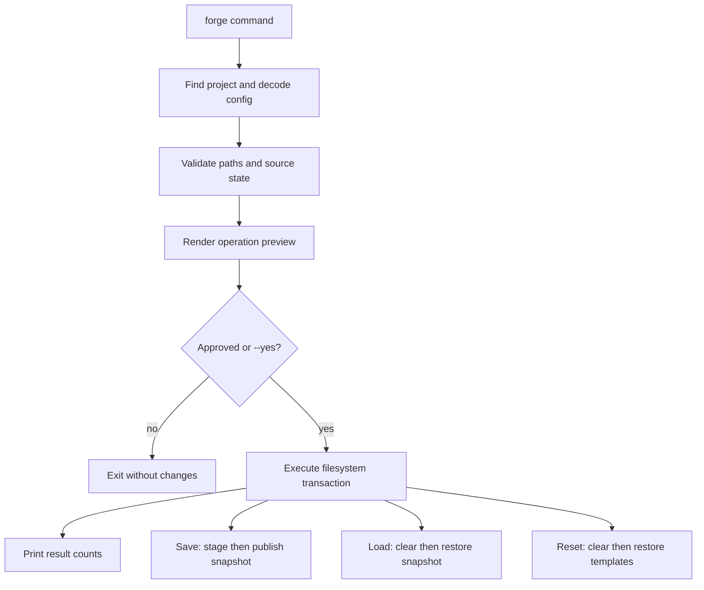

# refactor: Replace plugin toolkit with standalone snapshot CLI

## Summary

Replace the Claude Code plugin-development toolkit with a Go CLI that saves, loads, and resets configured project state. The new product is a single binary with project-local configuration, snapshots, templates, explicit previews, and filesystem safety enforced by root-confined operations.

## Problem Frame

The repository currently expresses most behavior as Claude skills, slash-command instructions, and shell scripts. The desired product is narrower: a standalone CLI whose behavior does not depend on an agent interpreting Markdown. The replacement must make destructive filesystem behavior deterministic, testable, and safe enough to run interactively or with `--yes` in automation.

---

## Requirements

**Project discovery and configuration**

- R1. Search upward from the working directory for `.forge/config.yaml` and treat its parent as the project root.
- R2. Decode configuration strictly and require one non-empty list of literal, project-relative managed paths.
- R3. Reject absolute paths, traversal, `.`, `.forge`, duplicate paths, and paths that overlap through an ancestor/descendant relationship.
- R4. Resolve all project operations through a root-confined filesystem API and never follow a managed symlink during copy or removal.

**Snapshot lifecycle**

- R5. Store snapshots under `.forge/snapshots/<name>/`, using `default` when no name is supplied.
- R6. Save every managed path as either present or absent and preserve regular files, directories, permissions, and symlink text.
- R7. Replace an existing snapshot by default, fail before mutation with `--no-clobber`, and publish replacements atomically.
- R8. Load only a complete, valid snapshot whose manifest matches the configured managed-path set.
- R9. Load clears all managed paths before restoring present entries, leaving absent entries absent.

**Reset lifecycle**

- R10. Reset clears all managed paths and restores matching content from `.forge/templates/`.
- R11. Managed paths without template content remain absent after reset.
- R12. Templates use the same copy and symlink rules as snapshots.

**CLI safety and reporting**

- R13. `save`, `load`, and `reset` print a concise operation preview before mutation.
- R14. Each operation requires affirmative confirmation unless `--yes` is supplied.
- R15. A command that needs confirmation but lacks an interactive terminal fails without mutation.
- R16. Success output reports relevant saved, replaced, removed, restored, and absent counts.
- R17. Validation and preflight failures occur before any managed project path is changed.

**Product transition**

- R18. The repository builds and tests as a Go module requiring Go 1.25 or newer.
- R19. User documentation describes only the standalone CLI, its configuration, templates, snapshots, and safety behavior.
- R20. Claude plugin manifests, skills, slash commands, snippets, and legacy shell implementations are removed.

---

## Key Technical Decisions

- **Go 1.25+ and `os.Root`:** Use root-confined filesystem methods for reads, writes, removals, links, and renames. This rejects paths and symlink traversals that escape the opened project or snapshot root.
- **Standard-library command dispatcher:** Parse the three subcommands and their small flag sets with the standard library instead of adding a CLI framework.
- **Strict YAML configuration:** Use `go.yaml.in/yaml/v3` with known-field validation so misspelled configuration keys fail rather than silently changing behavior.
- **Internal JSON snapshot manifest:** Store snapshot metadata separately from mirrored data. The manifest records format version, snapshot name, and the present/absent state and kind of every configured path.
- **Mirrored data layout:** Store copied content under a snapshot `data/` directory and templates directly under `.forge/templates/`, both mirroring paths relative to the project root.
- **Transactional snapshot replacement:** Build a complete temporary sibling directory, validate it, move any existing snapshot aside, rename the temporary directory into place, and roll back if publication fails.
- **Preflight before destructive work:** Load and reset fully validate configuration, source metadata, and copyability before clearing managed paths. Runtime I/O failures after mutation remain possible and must produce a non-zero exit with a clear partial-operation warning.
- **Filesystem engine separated from presentation:** Command code owns argument parsing, previews, prompts, and summaries. Reusable internal packages own discovery, validation, manifests, copying, removal, and restoration.

---

## High-Level Technical Design



The command layer constructs an operation plan during preflight. The same plan drives the human-readable preview and execution, preventing the approved action from drifting from the performed action.

For copying, inspect each entry with `Lstat`. Recreate symlinks from their stored link text, walk directories without following links, and stream regular-file content while preserving permission bits. Unsupported file kinds such as sockets, devices, and named pipes fail preflight.

---

## Output Structure

```text
.
├── cmd/
│   └── forge/
│       └── main.go
├── internal/
│   ├── app/
│   │   ├── app.go
│   │   ├── app_test.go
│   │   ├── save.go
│   │   ├── load.go
│   │   └── reset.go
│   ├── config/
│   │   ├── config.go
│   │   └── config_test.go
│   ├── project/
│   │   ├── project.go
│   │   └── project_test.go
│   ├── snapshot/
│   │   ├── manifest.go
│   │   ├── store.go
│   │   └── store_test.go
│   └── tree/
│       ├── tree.go
│       └── tree_test.go
├── integration/
│   └── cli_test.go
├── .github/
│   └── workflows/
│       └── ci.yml
├── go.mod
├── go.sum
└── README.md
```

The implementer may adjust package boundaries if tests expose a simpler shape, but command presentation must remain separate from filesystem mutation.

---

## Implementation Units

### U1. Establish the Go CLI skeleton and project discovery

**Goal:** Create the Go module, executable entry point, command dispatcher, upward project discovery, and strict configuration loading.

**Requirements:** R1-R4, R18.

**Dependencies:** None.

**Files:**

- `go.mod`
- `go.sum`
- `cmd/forge/main.go`
- `internal/app/app.go`
- `internal/app/app_test.go`
- `internal/config/config.go`
- `internal/config/config_test.go`
- `internal/project/project.go`
- `internal/project/project_test.go`

**Approach:**

- Set the module path to `github.com/alextacho/forge` and the minimum Go version to 1.25.
- Support `forge save [name]`, `forge load [name]`, and `forge reset`, with `--yes` available to all three and `--no-clobber` limited to save.
- Walk parent directories until `.forge/config.yaml` is found; stop cleanly at the filesystem root.
- Decode a minimal schema containing `paths`, reject unknown fields, and normalize path separators for the host platform.
- Validate path syntax and relationships before opening any managed path. Reject reserved `.forge` content, duplicate entries, and ancestor/descendant overlaps.

**Patterns to follow:** Keep `main` limited to process I/O and exit status. Inject working directory, streams, and terminal detection into the app layer so command behavior is testable without subprocesses.

**Test scenarios:**

1. Starting in the project root or a nested directory finds the nearest `.forge/config.yaml`.
2. Reaching the filesystem root without configuration returns a concise error.
3. Valid file and directory entries are normalized and retained in configuration order.
4. Unknown YAML keys, empty path lists, absolute paths, `..` escapes, `.`, `.forge` descendants, duplicates, and overlaps are rejected.
5. Each subcommand accepts only its documented positional argument and flags.

**Verification:** The binary displays stable help, resolves a nested working directory to its project root, and rejects unsafe configuration before constructing an operation.

### U2. Build the root-confined tree engine

**Goal:** Implement the shared filesystem primitives used to inspect, copy, remove, and restore managed trees without following symlinks.

**Requirements:** R4, R6, R9-R12, R17.

**Dependencies:** U1.

**Files:**

- `internal/tree/tree.go`
- `internal/tree/tree_test.go`

**Approach:**

- Represent inspected entries by relative path, kind, permissions, and symlink destination where applicable.
- Use `os.Root` for project and storage roots, `Lstat` for type inspection, and lexical directory walking that does not traverse symlinks.
- Copy regular files by streaming to a newly created destination and applying source permission bits after content is complete.
- Recreate directories parent-first and symlinks through the root API from uninterpreted link text, including targets outside the root because the target is never resolved during creation.
- Remove a managed path as one root-relative entry so a symlink is unlinked rather than traversed.
- Reject sockets, devices, named pipes, and other unsupported kinds during inspection.

**Execution note:** Implement the copy/remove behavior test-first because symlink and path-boundary failures are the highest-risk part of the product.

**Patterns to follow:** Prefer standard-library filesystem interfaces and explicit entry-kind switches. Keep planning/inspection separate from mutation so callers can preflight an entire operation.

**Test scenarios:**

1. Copying a regular file preserves content and executable/non-executable permission bits.
2. Copying nested directories reproduces their complete tree.
3. Relative and absolute symlinks are recreated with identical link text without reading their targets.
4. A symlink to content outside the project remains a symlink and the external target is unchanged during copy and removal.
5. Removing a file, directory, symlink, or absent path has deterministic results.
6. Unsupported filesystem entry kinds fail inspection before destination mutation.
7. Root-confined operations reject traversal and symlink-based escape attempts.

**Verification:** Tree tests prove round-trip equality for supported kinds and prove that external symlink targets are never read, copied, modified, or deleted.

### U3. Implement snapshot manifests and atomic save

**Goal:** Save the complete configured state into named snapshots and safely replace existing snapshots.

**Requirements:** R5-R7, R13-R17.

**Dependencies:** U1, U2.

**Files:**

- `internal/snapshot/manifest.go`
- `internal/snapshot/store.go`
- `internal/snapshot/store_test.go`
- `internal/app/save.go`
- `internal/app/app_test.go`

**Approach:**

- Validate snapshot names as a single portable path segment; reserve temporary and backup naming prefixes for internal use.
- Generate a versioned manifest containing the selected name and one record per configured path, including absent entries.
- Stage the manifest and mirrored `data/` tree in `.forge/snapshots/` under a unique temporary name.
- Validate the staged snapshot before publication.
- For replacement, move the current snapshot to a backup sibling, publish the staged snapshot with a rename, then remove the backup. Restore the backup if publication fails.
- Build a save operation plan that reports present, absent, new, and replacement counts before prompting.
- Implement `--no-clobber` as a preflight failure and `--yes` as confirmation bypass.

**Test scenarios:**

1. Covers AE1: saving without a name creates or replaces `default` after approval.
2. Saving a named snapshot records files, directories, symlinks, and absent paths.
3. Covers AE2: `--no-clobber` fails without modifying an existing snapshot.
4. Declining confirmation leaves both project state and snapshot state unchanged.
5. Non-interactive save without `--yes` fails without creating staging content.
6. A forced staging or publication failure leaves the previous snapshot complete and usable.
7. Unsafe snapshot names and invalid managed entries fail before snapshot replacement begins.

**Verification:** A saved snapshot validates against its manifest, an interrupted replacement preserves the prior snapshot, and preview output matches the operation counts used during execution.

### U4. Implement exact snapshot loading

**Goal:** Validate and restore a selected snapshot so managed paths exactly match its recorded state.

**Requirements:** R8-R9, R13-R17.

**Dependencies:** U2, U3.

**Files:**

- `internal/snapshot/store.go`
- `internal/snapshot/store_test.go`
- `internal/app/load.go`
- `internal/app/app_test.go`

**Approach:**

- Resolve omitted names to `default` and allow `default` explicitly.
- Validate manifest version, snapshot name, unique entries, path safety, configured-path equality, source presence, and source entry kinds before prompting.
- Build the preview from current managed state and snapshot state, including removal, restoration, and absent counts.
- After approval, clear every managed path and restore only manifest entries marked present.
- If mutation fails after clearing begins, stop immediately, report the failed path, and state that restoration may be partial.

**Test scenarios:**

1. Loading `default` implicitly and explicitly produces the same state.
2. Covers AE3: a path recorded absent is removed when it exists at load time.
3. Covers AE4: extra files in a managed directory are removed before snapshot restoration.
4. Files, directory trees, permission bits, and symlink text survive save/load round trips.
5. Missing, malformed, unsupported-version, incomplete, or config-mismatched snapshots fail before project mutation.
6. Declined and non-interactive unapproved loads leave managed paths untouched.
7. A restore-time permission failure returns non-zero and identifies that the project may be partially restored.

**Verification:** Integration fixtures saved from one state can replace a materially different state with byte-for-byte equivalent supported content and no stale managed files.

### U5. Implement template-based reset

**Goal:** Clear managed paths and restore the committed template baseline.

**Requirements:** R10-R17.

**Dependencies:** U2.

**Files:**

- `internal/app/reset.go`
- `internal/app/app_test.go`

**Approach:**

- Inspect `.forge/templates/` using the same relative managed paths as the project.
- Treat absent template entries as intentional absence, not an error.
- Preflight every present template entry before prompting.
- Preview which current paths will be removed, which templates will be restored, and which paths will remain absent.
- After approval, clear all managed paths and restore present template entries through the shared tree engine.

**Test scenarios:**

1. Covers AE5: reset restores a templated path and leaves an untemplated managed path absent.
2. Reset removes stale files inside managed directories before template restoration.
3. Template files, directories, permissions, and symlink text are reproduced.
4. An invalid or unsupported template entry fails before project mutation.
5. Covers AE6 and AE7: declined reset changes nothing, while `--yes` succeeds without reading input.
6. A template symlink targeting outside the project is recreated without traversing or changing its target.

**Verification:** Repeated resets are idempotent and always produce the same managed state for unchanged configuration and templates.

### U6. Add executable-level integration coverage

**Goal:** Verify the compiled CLI contract across process boundaries and temporary project trees.

**Requirements:** R1-R19.

**Dependencies:** U3, U4, U5.

**Files:**

- `integration/cli_test.go`

**Approach:**

- Build the command once per test package and execute it against isolated temporary projects.
- Drive stdin, stdout, stderr, working directory, and environment explicitly.
- Assert exit codes and concise output semantics in addition to filesystem state.
- Keep lower-level fault injection in package tests; use integration tests for real command parsing, discovery, prompts, and end-to-end state transitions.

**Test scenarios:**

1. Save, mutate, and load `default` from a nested working directory.
2. Save and load a named snapshot while preserving the independent default snapshot.
3. Save twice under one name and verify replacement; repeat with `--no-clobber` and verify failure.
4. Reset from committed-style templates and verify untemplated paths are absent.
5. Run all commands without `--yes` using affirmative and negative responses.
6. Run all commands with closed stdin and verify only `--yes` permits mutation.
7. Covers AE8: configure unsafe paths and exercise external-target symlinks, verifying no external content changes.
8. Verify malformed config and corrupted snapshots produce non-zero exits without managed-path mutation.

**Verification:** The integration suite proves every command's public syntax, discovery behavior, approval gate, and primary success/failure flow using the built binary.

### U7. Replace plugin documentation and remove obsolete surfaces

**Goal:** Make the repository describe and ship only the standalone CLI.

**Requirements:** R19-R20.

**Dependencies:** U6.

**Files:**

- `README.md`
- `.gitignore`
- `.github/workflows/ci.yml`
- `forge.yaml` (delete)
- `.claude-plugin/` (delete)
- `skills/` (delete)
- `commands/` (delete)
- `snippets/` (delete)
- `dev/` (delete)
- `PLAN.md` (delete or replace only if it still carries current product decisions)

**Approach:**

- Rewrite the README around installation/building, `.forge/config.yaml`, commands, snapshot naming, templates, confirmation, `--yes`, `--no-clobber`, safety restrictions, and recovery expectations after an I/O failure.
- Include a minimal configuration example and a project tree showing committed templates versus ignored snapshots.
- Ignore `.forge/snapshots/` without ignoring `.forge/config.yaml` or `.forge/templates/`.
- Remove Claude plugin assets and legacy shell implementations only after equivalent CLI integration tests pass.
- Add Linux and macOS CI jobs that enforce formatting, vetting, unit tests, and executable-level integration tests.
- Keep `docs/brainstorms/` and `docs/plans/` as product history.

**Test scenarios:**

- Test expectation: none for deletion and prose changes; executable behavior is covered by U6.
- Verify documented command forms and configuration keys match the implemented help and parser.
- Verify ignore rules exclude snapshots while allowing configuration and templates to be tracked.
- Verify CI exercises the supported Go version and both target operating systems.

**Verification:** Repository search finds no active `/forge:*` skill instructions or Claude plugin installation guidance, and a new user can understand the complete CLI workflow from the README.

---

## Acceptance Examples

- AE1. Saving twice without a name replaces the `default` snapshot only after approval.
- AE2. Saving an existing name with `--no-clobber` exits non-zero and preserves the original snapshot.
- AE3. Loading a snapshot removes a currently present path that the snapshot recorded as absent.
- AE4. Loading a snapshot removes extra files from managed directories instead of overlaying the saved files.
- AE5. Reset restores matching templates and leaves managed paths without templates absent.
- AE6. Declining any command or lacking interactive input prevents all mutation.
- AE7. `--yes` permits each command to run without interactive input.
- AE8. Unsafe configured paths are rejected, while symlinks are preserved without traversing or modifying their targets.

---

## Scope Boundaries

**In scope**

- One local binary and one `.forge/config.yaml` per project.
- Literal files and directories under one project root.
- Named and default local snapshots.
- Template-based reset and exact load semantics.
- Cross-platform behavior supported by Go and `os.Root`, with symlink tests skipped only where the platform reports symlinks unsupported.

**Outside this product**

- Claude skills, slash commands, plugin manifests, marketplace packaging, and snippet installation.
- Glob patterns, external paths, overlay loading, global snapshots, remote storage, compression, encryption, retention policy, or snapshot listing/deletion commands.
- Following symlinks or copying special filesystem objects.

---

## Risks and Mitigations

- **Partial load or reset after an unexpected write failure:** Preflight all readable source state before deletion, stop on first mutation error, and report partial restoration clearly. Full rollback of arbitrary project trees is outside scope.
- **Snapshot replacement loss:** Stage and validate before publication, retain the old snapshot until the new rename succeeds, and test rollback with injected failures.
- **Path alias ambiguity:** Reject normalized duplicates and ancestor/descendant overlaps rather than depending on configuration order.
- **Self-destruction through configuration:** Reject `.`, `.forge`, and paths containing the CLI's own control directory.
- **Platform filesystem differences:** Centralize file-kind and permission behavior, test on supported CI operating systems, and document that ownership, extended attributes, ACLs, and timestamps are not preserved in v1.
- **Concurrent commands:** Document concurrent mutation as unsupported in v1. A future locking design must address cross-platform behavior and stale locks rather than relying on a fragile marker file.

---

## Documentation and Operational Notes

- Document `.forge/config.yaml` as committed configuration.
- Document `.forge/templates/` as committed baseline content and `.forge/snapshots/` as ignored local state.
- Explain that `--yes` bypasses only approval, not validation.
- Explain that load and reset are destructive exact-state operations.
- State the v1 metadata contract: file content, directory structure, permission bits, and symlink text are preserved; ownership, ACLs, extended attributes, and timestamps are not.
- State that users must not run mutating commands concurrently within one project.
- Add CI for formatting, vetting, unit tests, and integration tests on at least Linux and macOS once the implementation exists.

---

## Sources and Research

- Origin requirements: `docs/brainstorms/2026-06-08-forge-snapshot-cli-requirements.md`
- Go `os.Root` provides root-confined filesystem operations and rejects names or symlink traversal outside the root: [Go `os` documentation](https://pkg.go.dev/os#Root)
- Go directory walking does not follow symbolic links: [Go `path/filepath` documentation](https://pkg.go.dev/path/filepath#WalkDir)
- YAML v3 supports strict known-field decoding through `Decoder.KnownFields`: [YAML v3 documentation](https://pkg.go.dev/go.yaml.in/yaml/v3)
